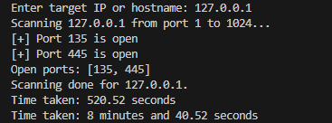

# Port Scanner

A simple Python-based **TCP port scanner** that checks for open ports on a specified IP address or hostname.  
This tool is built using only Python’s built-in libraries, making it lightweight and easy to understand for anyone learning network programming or ethical hacking.

---

## 🎯 Why I Built This Project

I built this project as a hands-on way to:
- Learn how **network sockets** work in Python
- Understand the fundamentals of **TCP communication**
- Explore how port scanning tools like Nmap operate under the hood
- Practice building a real-world tool using **basic programming constructs**

---

## 💡 What I Learned

- How to use Python’s `socket` module to create TCP connections
- How to implement **port scanning** logic
- How to calculate and display **execution time**
- Why scanning responsibly and legally is critical in cybersecurity

---

## 🚀 Features

- Scans a specified range of **TCP ports**
- Detects and prints all **open ports**
- Displays **total time taken** in seconds and in minutes + seconds
- Uses a **simple and readable structure** with no external dependencies

---

## 📌 Why This Project Is Useful

- Helps new developers understand how **networks and ports** work
- Serves as a lightweight alternative to more complex tools like Nmap

---

## 🧰 Requirements

- Python 3.x
- No third-party libraries required

---

## 📦 How to Use

1. **Clone this repository**:

    ```bash
    git clone https://github.com/yourusername/port-scanner.git
    cd port-scanner
    ```

2. **Run the script**:

    ```bash
    python main.py
    ```

3. **Input the target IP or hostname when prompted**:

    ```text
    Enter target IP or hostname: 192.168.1.254
    ```

---

<h2>🖼️ Example Output</h2>
<p align="center">
  
</p>


---

## ⚠️ Legal and Ethical Warning

> This tool is meant for **educational purposes** and **authorized testing only**.  
> Scanning networks or devices **without permission** is **illegal and unethical**.  
> Always obtain **explicit authorization** before running port scans on systems you do not own.

---

## 📄 License

This project is licensed under the **MIT License**.  
See the [LICENSE](LICENSE) file for details.

---

## 📬 Contributions

Pull requests and suggestions are welcome.  
